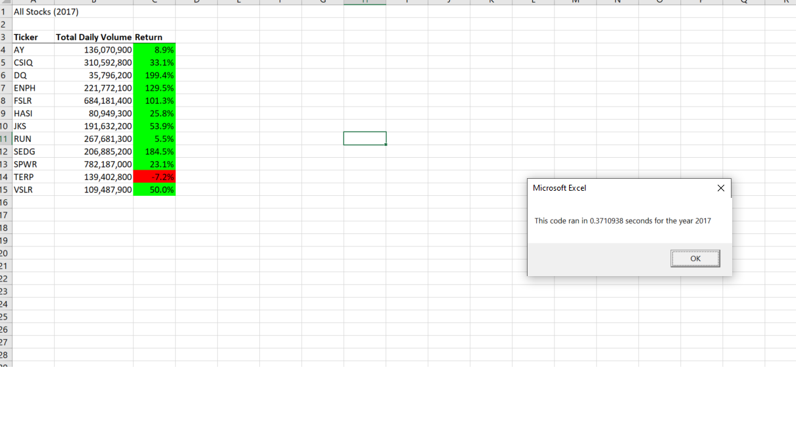
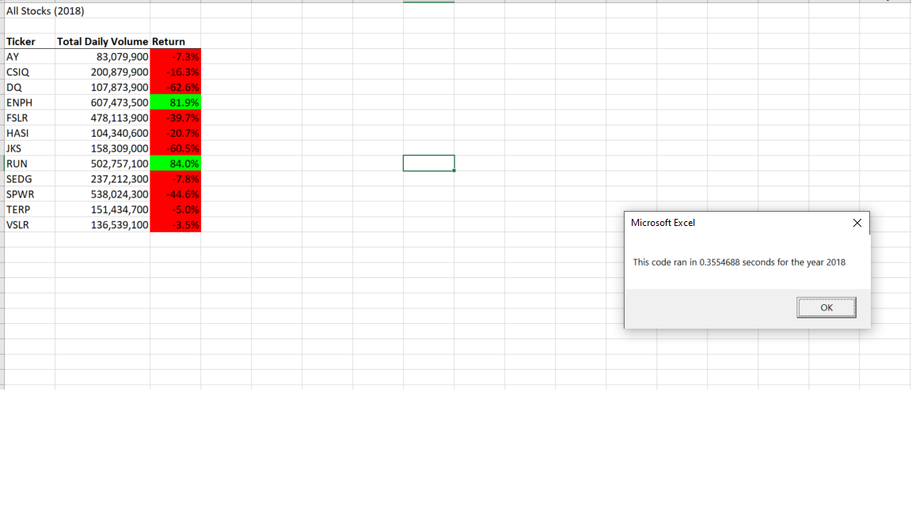

# Stock-Analysis
## Overview:
### The purpose of the analysis was to understand how we can simplify the coding process to the entire dataset.  The purpose of the project was to create a cleaner code to help analyze any year inputted into the question statement. 

## Results
Overall, it looks like Steve's parents had a better return in 2017 than 2018.  Majority of their stocks in 2017 was a loss, while 2018 was a growth year for them.  However, it seems like ticker "TERP" continues to not be a profitable stock for them from 2017- 2018. I understand the refactoring code was support to be faster but it seem to take me a lot longer to understand and code. 

## Summary
#### Question 1: 
  Advantages with working on a refactoring code is time.  It would help the user save time and efficienties.  
  Disadvantages with refactoring code is bugging issues when information updated or changed. 
#### Question 2:
  With the refactoring code, it help save time from rewriting the same code for a different year.  This was helpful to finding the answer easier. However, I found that it was difficult to complete and create the refactoring code compared to the original code. 
  
